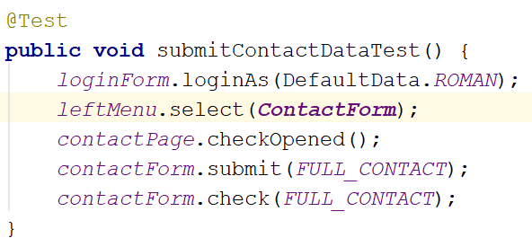
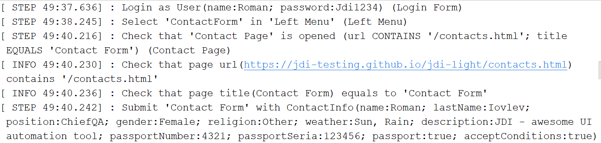
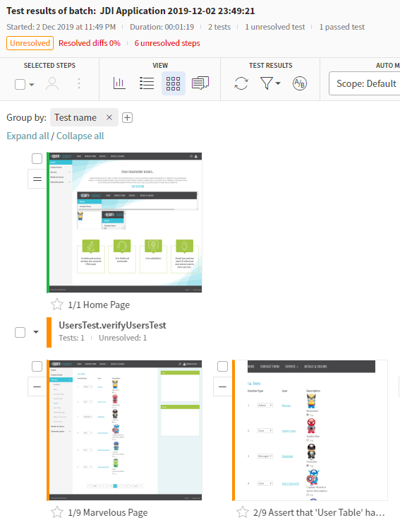
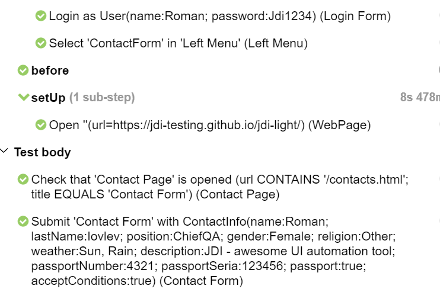
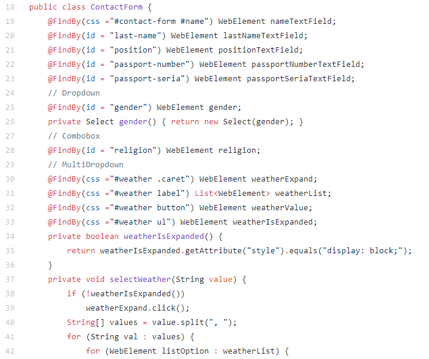
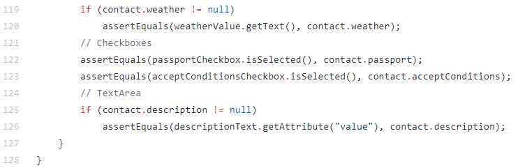
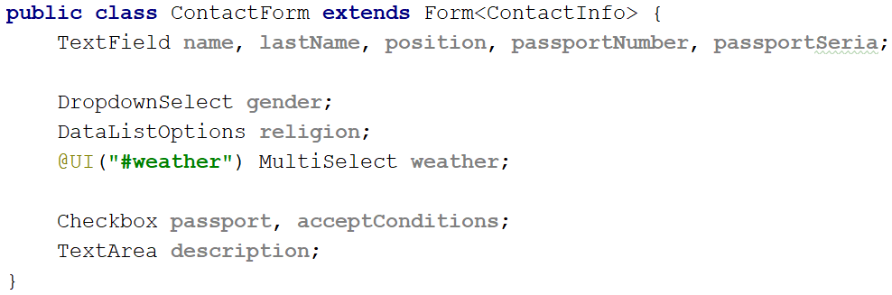

# Improve Selenium tests with JDI Light and Applitools
Imagine you have project with Selenium tests and you would like to improve your tests: 
1. Improve tests stability and add logs for common actions 
2. Add Visual testing 
3. Add good reports 
4. Reduce amount of code in 2-3 times and make it much more maintainable 
You can do all of this with minimal effort with jdi-light-eyes (see how it is easy in [commits](https://github.com/jdi-tutorials/applitools-01-selenium/commits/master))  

## 1. Switch to jdi-light-eyes
You can switch your project [with few lines of code to jdi-light-eyes](https://github.com/jdi-tutorials/applitools-01-selenium/commit/e22fd40298724020208fd4a51b96008566450ad7) and get more stability and good logs of all actions. 

## 2. Switch on visual testing with applitools
Add visual validations with applitools for each new page opened and each isDisplayed action in already developed tests, just [with 3 methods in before suite class](https://github.com/jdi-tutorials/applitools-01-selenium/commit/fdcaafe540decd2c7293c1fbcbf3aff283c8c581) and adding simple properties files. 

## 3. Add allure report
[Add allure settings](https://github.com/jdi-tutorials/applitools-01-selenium/commit/04ed6942f7929a3f9a3bbb294f73a032ed7db22a) and all actions will be shown in great Allure report that you can generate with allure:serve command. 

## 4. Switch tests to Jdi Light
Now you can [improve your tests using jdi-light features](https://github.com/jdi-tutorials/applitools-01-selenium/commit/e98a7d05ed9515a8d4855f92b58c9a755fd39582) and reduce code in 2-3 times. Make it clear to understand and easy to maintain. 
**SELENIUM (108 lines of code)** 
 
 
**JDI LIGHT (6 lines of code)** 

